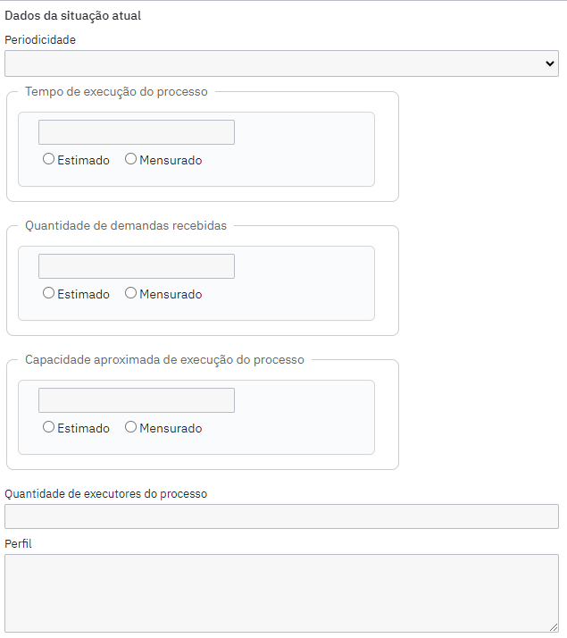

# camunda-modeler-process-additional-info

Plugin para o Camunda Modeler que permite documentar informações adicionais sobre processos BPMN, como dados gerais, situação atual, fornecedores, clientes, regras de negócio, entre outros.

## Funcionalidades

- Adiciona grupos ao painel de propriedades do Camunda Modeler:
  - **Metadados do Mapeamento**: Versão, data, tipo (AS-IS/TO-BE) e equipe do mapeamento
  - **Documentação do Processo**: Informações gerais do processo
  - **Dados da situação atual**: Métricas e características operacionais
  - **Indicadores do Processo**: Gestão de KPIs do processo

### O plugin permite registrar:

#### Metadados do Mapeamento
- Versão e data do mapeamento
- Tipo de mapeamento (AS-IS/TO-BE)
- Equipe responsável pelo mapeamento (gestor, gerente, consultores)

#### Documentação do Processo
- Código e nome do processo
- Entradas, saídas, fornecedores e clientes
- Objetivo e principais regras de negócio
- Interface com outros processos
- Dono do processo (Área/Gestor)
- Atores envolvidos
- Sistemas utilizados
- Legislação/normativos aplicáveis
- Análise preliminar de necessidades

#### Dados da Situação Atual
- Periodicidade do processo
- Tempo de execução
- Quantidade de demandas recebidas
- Capacidade aproximada de execução
- Quantidade e perfil dos executores
- Contagem de atividades (manuais, usuário, automatizadas)
- Indicador de desempenho

#### Indicadores do Processo
- Gerenciamento dinâmico de indicadores
- Para cada indicador:
  - Nome e objetivo
  - Fórmula de cálculo
  - Meta estabelecida
  - Última medição e resultado

## Exemplo de uso

### Informações gerais do processo


### Dados da situação atual



## Instalação

1. Clone este repositório ou baixe os arquivos.
2. Execute `npm install` para instalar as dependências.
3. Gere o bundle do plugin:
   ```sh
   npm run bundle
   ```
4. Copie a pasta do projeto para a pasta de plugins do Camunda Modeler ou registre o plugin conforme a [documentação oficial](https://docs.camunda.io/docs/components/modeler/desktop-modeler/plugins/).

## Uso

1. Abra o Camunda Modeler.
2. Importe ou crie um diagrama BPMN.
3. Selecione o elemento raiz (Definitions) para visualizar e preencher as informações adicionais no painel de propriedades.

## Estrutura do Projeto

- `client/` - Código-fonte do plugin:
  - `properties-panel/` - Implementação dos grupos de propriedades
  - `styles/` - Estilos customizados do painel
  - `client.js` - Ponto de entrada do cliente
- `index.js` - Arquivo de entrada do plugin para o Camunda Modeler
- `webpack.config.js` - Configuração de build
- `package.json` - Dependências e scripts

## Desenvolvimento

Para desenvolvimento, utilize:
```sh
npm run bundle:watch
```
Assim, o bundle será atualizado automaticamente a cada alteração.

## Licença

MIT

---

> Imagens acima: exemplos reais do plugin em funcionamento no Camunda Modeler.